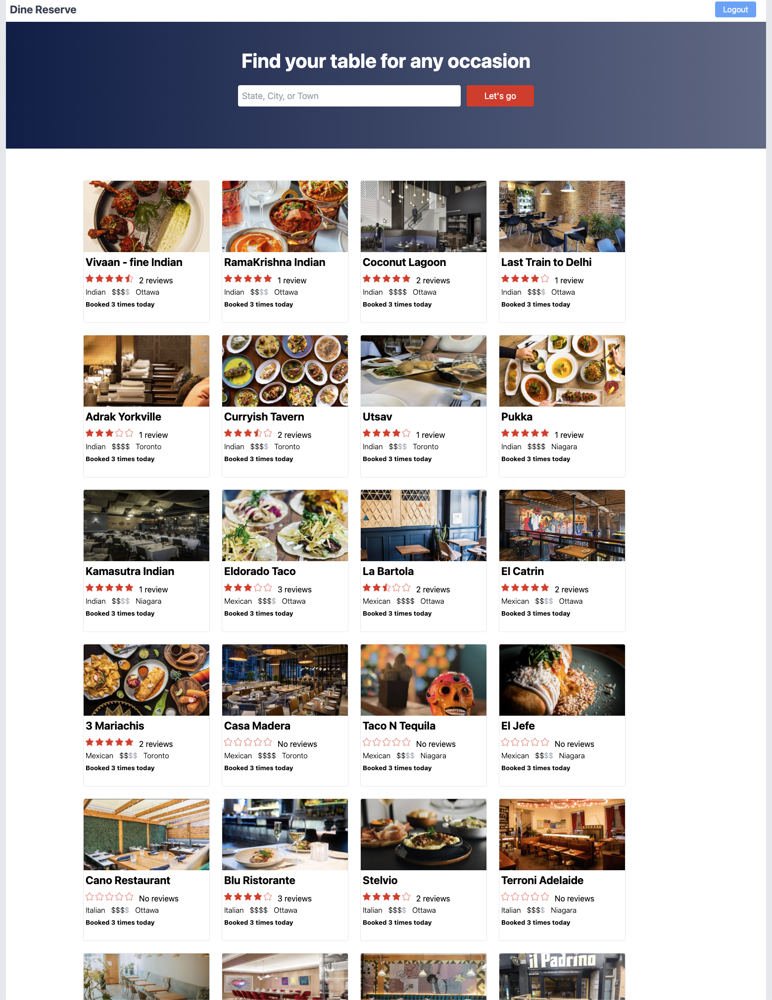
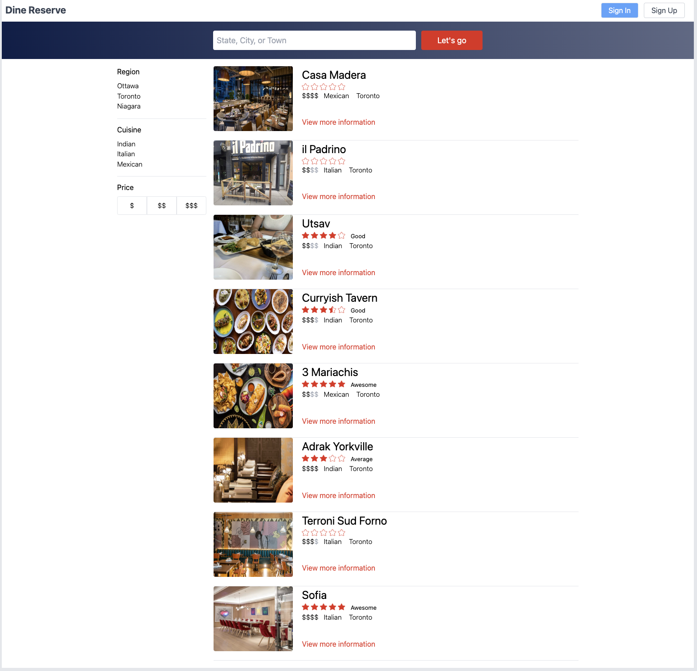
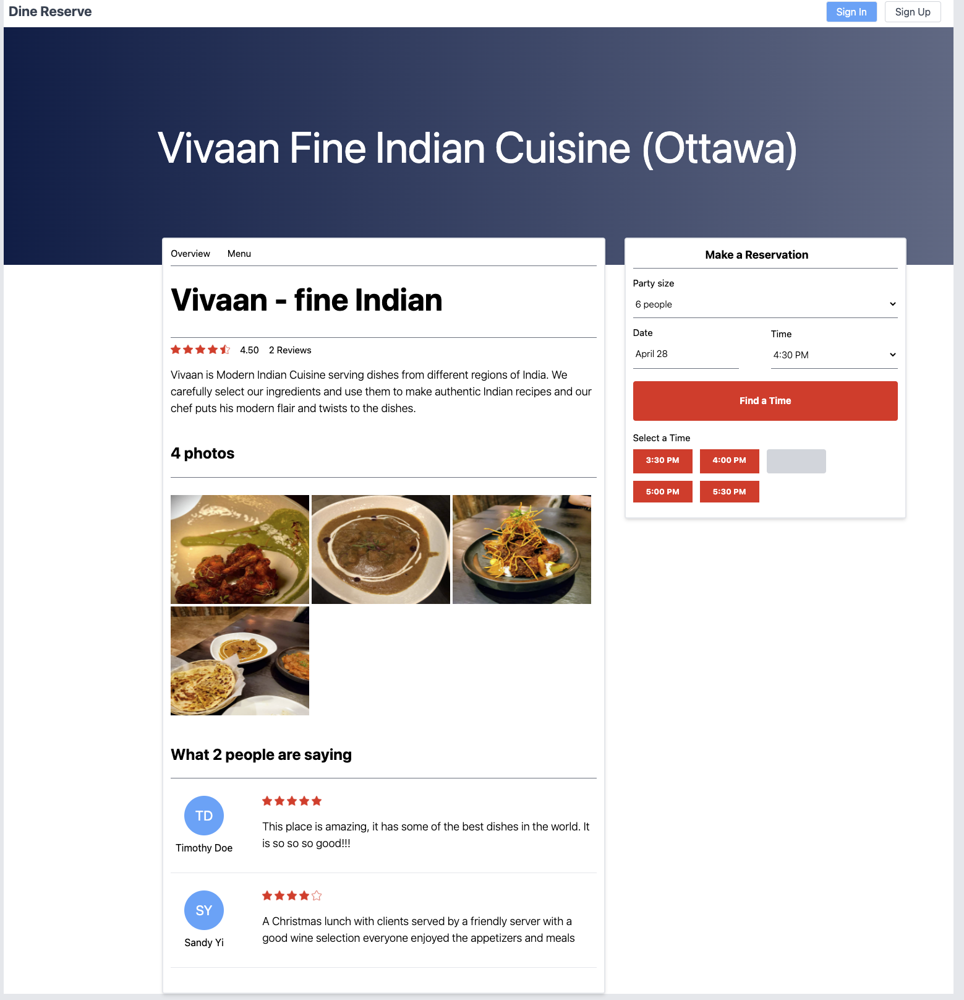
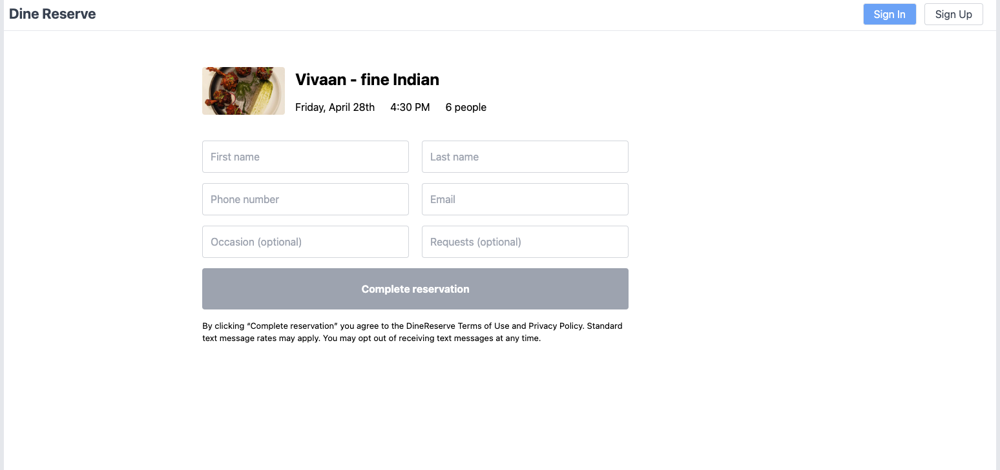

# dine-reserve


___

[You can see the deployed live site here](https://reserve-next.vercel.app/)
___

## Description

DineReserve lets users browse restaurants, filter pricing, and book reservations.

## Table of Contents

* [Installation](#installation)
* [Usage](#usage)
* [Credits](#credits)
* [License](#license)
* [Questions](#questions)

## Installation

Run the following command to install this locally:

```
npm install
```

To run off your own Supabase cloud database, insert a .env file at the root level and insert the following variable:

```
DATABASE_RUI=<YOUR_SUPABASE_CONNECTION_STRING>
```

You will also need to supply your own JWT secret, also stored within .env as:
```
JWT_SECRET=<YOUR_JWT_SECRET_PHRASE>
```

If you choose to also deploy this on your own cloud-based PaaS (e.g. Supabase), you will need to update the dynamicUri located within lib/client.ts.


## Usage

_<p align="center">Landing page</p>_ 


_<p align="center">Filter page</p>_ 


_<p align="center">Restaurant page</p>_ 


_<p align="center">Reserve page</p>_ 


After installing the app or launching the deployed link, the User can:
- Click on any restaurant card on the main page to view the respective Restaurant page

- Search cities and filter results

- Preview restaurant details, menu, and reviews

- Use the reservation card within the Restaurant page to look for availability of tables based on party size, date, and time 
(Note: this is only implemented fully within Vivaan and RamaKrishna restaurants for now)

- Upon finding a matching time slot, the user can click on the time slot to be taken to the reservation page

## Credits

This project was largely built in tandem with the Udemy course [The Next.js 13 Bootcamp - The Complete Developer Guide](https://www.udemy.com/course/the-nextjs-13-bootcamp-the-complete-developer-guide/) with various changes including using [Next.js version 13.3](https://nextjs.org/blog/next-13-3) (using the experimental app directory) and use of ApolloQL for API related code. 

[The Next.js 13 Bootcamp - The Complete Developer Guide](https://www.udemy.com/course/the-nextjs-13-bootcamp-the-complete-developer-guide/)

[Restaurant Icon by Icons8](https://icons8.com/icon/kuqvHKbsjVtV/restaurant)

## Thoughts and Observations

As I was developing the project, I noticed that slow load speeds over time, which mitigated some of the benefits of using Next.js. Upon further inspection, I learned that MUI [bundles sizes differently based on whether the app is in a development or production environment](https://mui.com/material-ui/guides/minimizing-bundle-size/). 

I also recognize that the algorithm for finding if a time slot can seat a party size is fairly basic; as I was focused on building a Nextjs app with GraphQL, I diverted my attention and resources elsewhere. If this were an actual product, I'd take much more consideration as it is arguably one of the most important features that highlights being able to book reservations. 

I'd also like to continue working on the cookies; right now they have httponly not set to true as the Apollo server is not able to parse the authorization header as expected which leads to invalidation of checking whether users are authorized. 

In addition, I'd like to continue working on the styling of the page, particularly making it more responsive for mobile devices. 

## License
    
This project is licensed under the MIT License. To learn more about this license, go to:

https://opensource.org/licenses/MIT 

## Questions

Questions, comments, concerns? Send me an email at rhong24@gmail.com.
